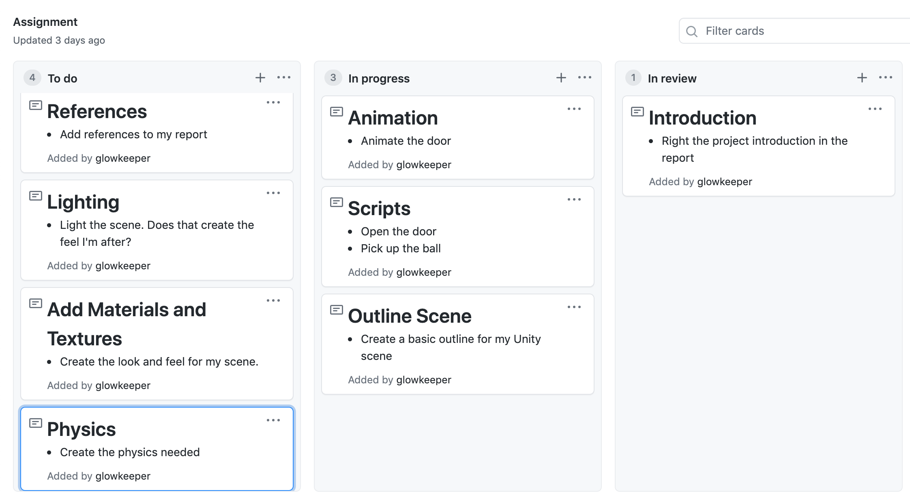
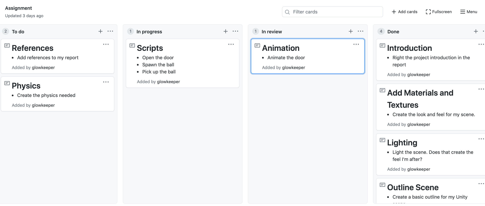
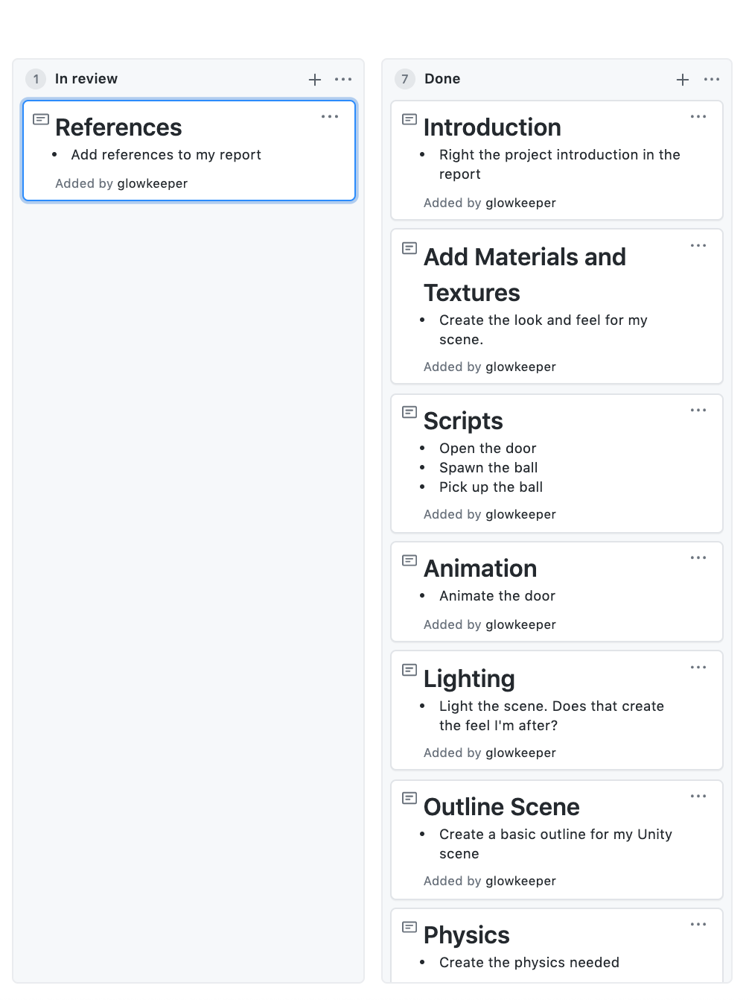
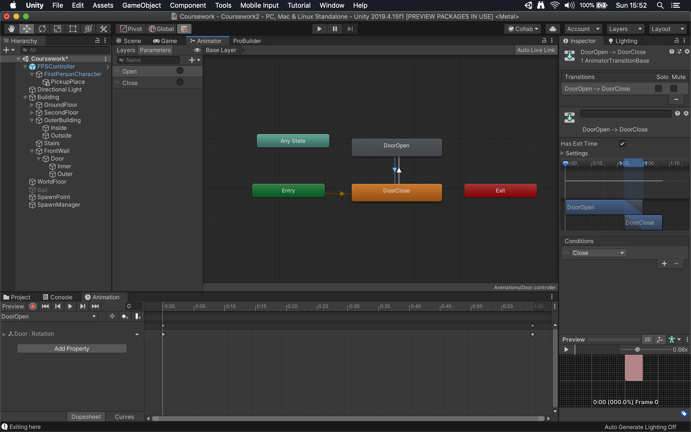

## Introduction

Building on the shipping container theme from the labs, my scene will feature two shipping containers stacked on top of one another. The first person controller (FPC) needs to pick up a ball and carry it up to the first floor, so each of the spaces where the FPC goes will need to be wide enough so that they have room for the FPC and ball. Hence, these are going to be the dimensions of my spaces:

+ Ground floor - 3m wide, x 3m high x 6m long.
+ First floor - 3m wide, x 3m high x 6m long.
+ Front (door) wall - 5m wide x 6m high x 0.1m deep.
+ Door - 2m wide x 2m high.
+ Outside building envelope - 5m wide, 6m high x 10m long.
+ Stairs - 2m wide x 3m high x 10m long. The steps will be a metre wide, except the top and bottom steps, which will each be two metres wide.

The first floor will be stacked two metres forward of the ground floor so that it creates an overhang. The stairs will rise to the left of the ground floor so that the top and bottom steps push beyond the ground floor by two metres each. The outside building envelope will encompass each of the front wall, ground and first floor rooms, as well as the stairs.

The scene will feature three scripts:

1. Open and close the door
2. Spawn the ball
3. Pick up and drop the ball

A key-press (E) will open the door once the FPC is within a trigger area. Once the player leaves the trigger area, the door will close. Another key-press (B) will spawn a ball towards the back of the ground floor. A third key-press (P) will pick up the ball by transforming to a point just in front of the FPC, which will carry the ball up the stairs. Finally, a key-press (L) will drop the ball, so it falls down the stairs.

### Project Plan

Below shows the planning of my project.

#### Setting up the Scene



_Figure 1: Initial plan_

#### Animating and Scripting



_Figure 2: Animating and scripting_

#### Completing the Scene



_Figure 3: Finished project_

## Technical Element

I used diffuse materials (Shirley, 2020) to attempt to recreate a post-industrial 'shipping container' feel to my scene...

## Script

The _PickUp.cs_ script below is attached to the first-person controller. It will pickup and drop the ball. Both the transform _pick up place_ and the name of that _pick up place_ are _serialised private_ fields; that way, they **are not** exposed to other game objects but **are** exposed in the inspector window. That means the _PickUp.cs_ script is configurable should I choose to pick up objects other than a ball in my scene.

```
script goes here
```

## Animation

Figure 1, below, shows an animation controller for opening and closing the door.



_Figure 4: Door animation_

## Summary

My scene demonstrates all the essential elements introduced throughout the labs, such as lighting, materials and textures, 3D physics, first-person controllers, scripting and animation. It also incorporates some particle effects when...

## Future Work

I see more scenes, describing more worlds featuring...

## Appendix

Door.cs:

```
script here
```

Pickup.cs:

```
script here
```

Spawn.cs:

```
script here
```

## References

Below are all the references used in my application and report.

### GitHub

GitHub homepage: https://github.com/glowkeeper/P3D

Application directory: https://github.com/glowkeeper/P3D/src/assignment

### Asset References

+ [Standard Assets](https://assetstore.unity.com/packages/essentials/asset-packs/standard-assets-for-unity-2018-4-32351)
+ [Free Shipping Containers](https://assetstore.unity.com/packages/3d/environments/industrial/free-shipping-containers-18315)
+ [Old USSR Lamp](https://assetstore.unity.com/packages/3d/props/electronics/old-ussr-lamp-110400)
+ [PBR LAMPS PACK](https://assetstore.unity.com/packages/3d/props/interior/free-pbr-lamps-70181)
+ [Ball Pack](https://assetstore.unity.com/packages/3d/props/ball-pack-446)

### Script References

+ [Door opening](http://somewhere.com)
+ [Spawn ball](http://somewhere-else.com)
+ [Pick up ball](http://somewhere-else-again.com)

### Report References

Peter Shirley, 2020, Ray Tracing in One Weekend, Diffuse Materials. Available at https://raytracing.github.io/books/RayTracingInOneWeekend.html#diffusematerials, Accessed October, 2020.
