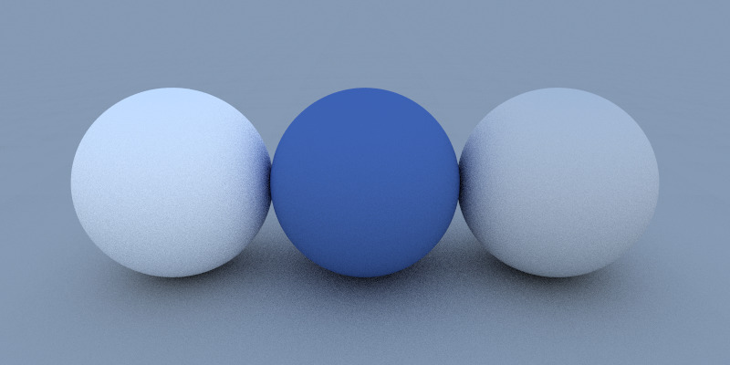
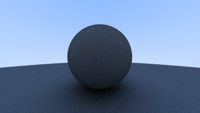

# 3D Graphics

Below explains some of the concepts that will enable you to understand 3D graphics. Much of the material is drawn from the brilliant [Ray Tracing in One Weekend](https://raytracing.github.io/books/RayTracingInOneWeekend.html), so for those of you who would like more detail, please visit there ([Ray Tracing in One Weekend](https://raytracing.github.io/books/RayTracingInOneWeekend.html) relies on [C++](https://en.wikipedia.org/wiki/C%2B%2B) to demonstrate its concepts, but even if you cannot read C++, don't let that put you off as the explanations are nice and clear).

## A Brief Aside - The Maths

You are not required to have any prior maths to complete this module. However, if you are interested in that maths, or have some mathematical background, [Ray Tracing in One Weekend](https://raytracing.github.io/books/RayTracingInOneWeekend.html) gives more detail. Much of the maths focuses on _vectors_, and in the [useful links](#useful-links) section, there is a link to a lecture from a previous year of P3D, which gives an overview of vector operations. Additionally, the _Reading List_, on Canvas, includes a reference to _Essential mathematics for games and interactive applications: a programmer's guide_, which is available in the library.

## Ray Tracing

A ray is a line segment with a definite direction. [Ray tracing](https://www.khanacademy.org/computing/pixar/rendering/rendering1/v/rendering-1) is a graphics rendering technique for lighting objects. It is an algorithm that traces the path of light and simulates the way that the light interacts with objects in a virtual world. The technique relies on a _virtual viewport_ through which to pass rays for the image scene.

Ray tracing is a staple in films - indeed, in the [useful links](#useful-links) section, below, you will see a link to the excellent [Pixar in a Box](https://www.khanacademy.org/computing/pixar) on [Khan Academy](https://www.khanacademy.org/), which takes a behind-the-scenes look at how [Pixar](https://www.pixar.com/) artists do their jobs. The [Rendering 101](https://www.khanacademy.org/computing/pixar/rendering/rendering1/a/start-here-rendering) suite of videos there give an overview of rendering and ray tracing.

## Surface Normals and Anti-aliasing

[Normals](https://en.wikipedia.org/wiki/Normal_(geometry)) are rays that are perpendicular to an object. In three dimensions, the figure below shows that a surface normal at point P is a vector perpendicular to the tangent plane of the surface at point P. A normal is used in 3D graphics for shading, as it determines a surface's orientation towards a light source.

### Surface Normals

For a sphere, the [outward normal](https://raytracing.github.io/books/RayTracingInOneWeekend.html#surfacenormalsandmultipleobjects/shadingwithsurfacenormals) is in the direction of the intersection point, minus the centre.

The ability to determine the surface face is important for objects that are rendered differently on each side; for example, a glass ball has an inside and an outside - [Ray Tracing in One Weekend](https://raytracing.github.io/books/RayTracingInOneWeekend.html) gives more detail.

### Anti-aliasing

[Anti-aliasing](https://helpx.adobe.com/photoshop/key-concepts/aliasing-anti-aliasing.html) of digital images is the smoothing of jagged edges that result from high-contrast borders between pixels.

When you take a picture with a real camera, there are usually no jagged edges because [the edge pixels blend the foreground with the background](https://raytracing.github.io/books/RayTracingInOneWeekend.html#antialiasing). Anti-aliasing algorithms might achieve a similar effect by averaging the colours of the boundary pixels.

However, there are more advanced approaches - if you are interested in those, the [useful links](#useful-links) section contains a link to the user manual of [Pixar Studios'](https://www.pixar.com/) [Renderman](https://renderman.pixar.com/) product, which describes other anti-aliasing techniques. It also contains a link to a thorough examination of anti-aliasing for the [OpenGL API](https://www.opengl.org/).

## Diffuse Materials

Light is invisible to us until it hits an object, when some of its energy is absorbed, and some is reflected. Hence, our perception of a material's colour and texture is based on the manner light rays reflect its surface. [Diffuse materials](https://raytracing.github.io/books/RayTracingInOneWeekend.html#diffusematerials) are matt surfaces that absorb much of the light they receive - the darker they are, the more light they absorb.

A diffuse surface [reflects light in random directions](https://viclw17.github.io/2018/07/20/raytracing-diffuse-materials/). Thus, diffuse reflection is when light is reflected from a surface and scattered at many angles (as opposed to specular reflection, when light is reflected at just one angle).

The [useful links](#useful-links) section contains some links giving more detail about diffuse materials.

### Simulating Diffuse Materials with Ray Tracing

A simple algorithm for generating a diffuse material considers two unit radius spheres that are tangent to the point _P_ of a surface ([a unit sphere](https://en.wikipedia.org/wiki/Unit_sphere) is a sphere whose surfaces are of distance 1 from a fixed central point). These two spheres have a centre of 1) _P + n_ and 2) _P - n_ (where _n_ is the normal to the surface) - sphere 1) is the outside surface, and sphere 2) is inside. Select the unit radius sphere that is on the same side as the ray origin and its tangent surface. Then pick a random point _S_ inside that sphere and send a ray from the hit point _P_ to the random point _S_. To generate that random point, a _rejection algorithm_ is used, which rejects all points generated inside a random point within a cube until it finds a point on the inside of the tangent sphere.

### Gamma Correction

The sphere above is dark because it has not been [gamma corrected](https://en.wikipedia.org/wiki/Gamma_correction). Gamma correction is a process by which the [bits](https://en.wikipedia.org/wiki/Bit) that make up an image are transformed to take advantage of how we perceive light and colour. Human perception of brightness approximates a power function with greater sensitivity relative to differences between darker tones than the differences between lighter tones. The [useful links](#useful-links) section contains a link to a lecture from a previous year of P3D, which gives an overview of light and colour.

### Lambertian Reflection

[Lambertian reflectance](https://en.wikipedia.org/wiki/Lambertian_reflectance), is an ideal which defines a diffusely reflecting surface where the perceived brightness of the surface is the same regardless of the observer's angle of view (unfinished wood exhibits Lambertian reflectance).

For example, the rejection algorithm, described above, produces random points in the unit sphere that are offset along the surface normal. That produces a probability function that favours rays whose directions are close to the normal. The outcome is that light which arrives at shallow angles and which spreads over a larger area contributes less to the final colour. However, [true Lambertian reflection](https://raytracing.github.io/books/RayTracingInOneWeekend.html#diffusematerials/truelambertianreflection) maintains a uniform distribution for high probability rays that are scattered close to the normal. Hence, true Lambertian reflection is achieved by normalising points inside a diffuse material.

## Useful Links

+ [Ray Tracing in One Weekend](https://raytracing.github.io/books/RayTracingInOneWeekend.html)
+ [Rendering 101](https://www.khanacademy.org/computing/pixar/rendering/rendering1/a/start-here-rendering)
+ [Introduction to Animation](https://www.khanacademy.org/computing/pixar/animate/ball/a/start-here-animation)
+ [What is ray tracing? The games, the graphics cards and everything else you need to know](https://www.techradar.com/uk/news/ray-tracing)
+ [Advanced Ray Tracing](../advancedRayTracing.pdf)
+ [Vectors](../vectors.pdf)
+ [Basic Antialiasing in RSL](https://renderman.pixar.com/resources/RenderMan_20/basicAntialiasing.html)
+ [Anti Aliasing using OpenGL](https://learnopengl.com/Advanced-OpenGL/Anti-Aliasing)
+ [Light, Colour, Colour Spaces and Images](../lightAndColourPerception.pdf)
+ [Materials - Diffuse, Reflection, Transparency](https://www.suplugins.com/podium/help/materials-drt.php)
+ [Ray Tracing - Diffuse Materials](https://viclw17.github.io/2018/07/20/raytracing-diffuse-materials/)
