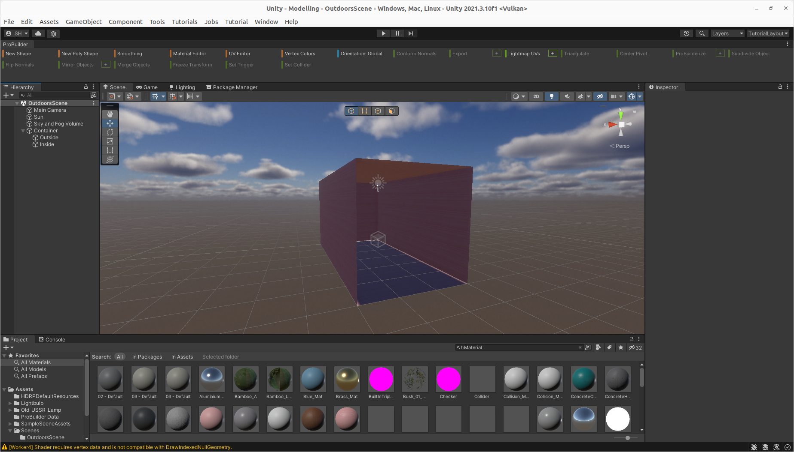
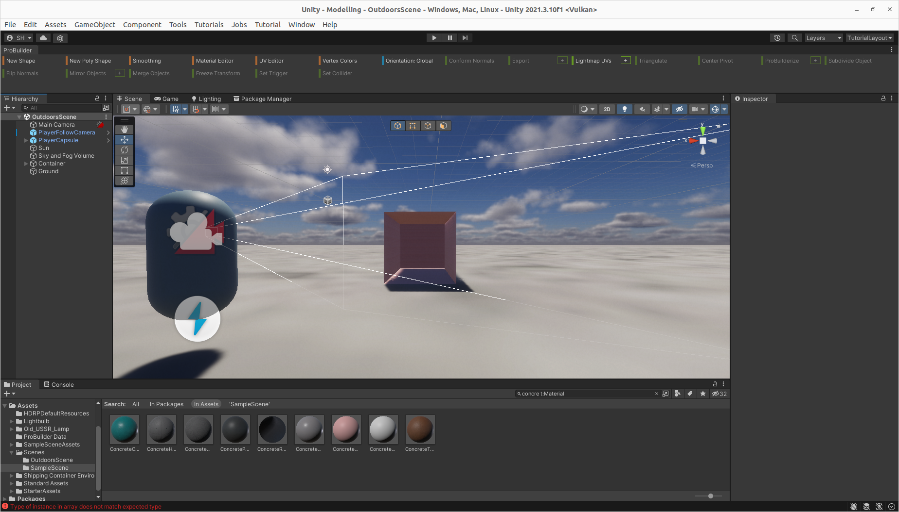
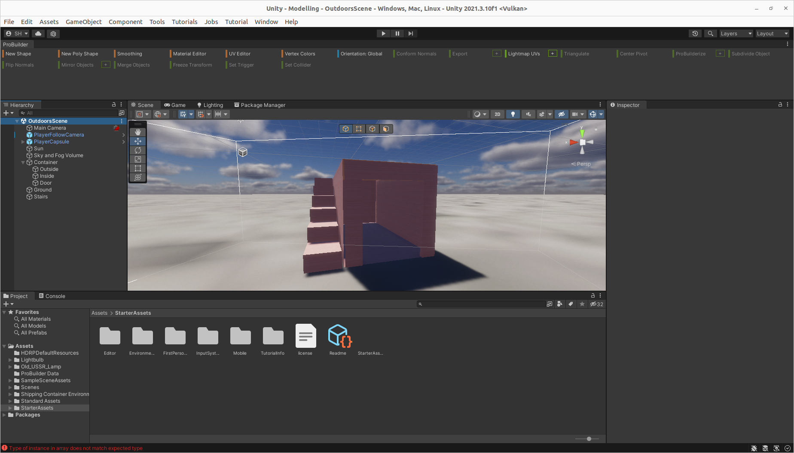

# Lab for Week 3, Session 1 - Modelling through ProBuilder and First-Person Controllers

This lab uses Unity's [ProBuilder](https://unity3d.com/unity/features/worldbuilding/probuilder) to recreate (and improve) the simple room created in the [first Unity lab](./week1Session2.md). It also introduces a first-person [character controller](https://docs.unity3d.com/Manual/class-CharacterController.html).

## Overview

[ProBuilder](https://unity3d.com/unity/features/worldbuilding/probuilder) is a unique hybrid of 3D modelling and level design - it allows you to build, edit, and texture custom geometry, so that you can prototype and create interesting scenes. ProBuilder also features a [Scripting API](https://docs.unity3d.com/Packages/com.unity.probuilder@4.2/manual/api.html), which means you can create customised tools via C# scripts (which are going to be introduced in a later lab).

A [first-person](https://en.wikipedia.org/wiki/First-person_(video_games)) controller shows the graphical perspective of the player. The roots of first-person games go back to the 1970s, with the release of [Spasim](https://en.wikipedia.org/wiki/Spasim) and [Maze War](https://en.wikipedia.org/wiki/Maze_War), and nowadays, there are many genres of game that give first-person perspectives; racing games and [flight simulators](https://en.wikipedia.org/wiki/Amateur_flight_simulation#Flight_simulators) are two notable examples.  However, it is the first-person shooters, popularised by games such as [Doom](https://en.wikipedia.org/wiki/Doom_(franchise)) and [Call of Duty](https://en.wikipedia.org/wiki/Call_of_Duty), for which the first-person perspective is perhaps best known.

## Recreating the Simple Room

Below, you will recreate the simple room you first built in [Week 1, Session 2](./week1Session2.md), but this time using ProBuilder. You will also add other features, such as stairs and an outside scene that a first-person controller can explore.

### ProBuilder

Open [Unity Hub](https://docs.unity3d.com/Manual/GettingStartedUnityHub.html), create a new project and choose the 3D Sample Scene (HDRP) template (naming the project however you choose) - this is Unity's [High Definition Render Pipeline](https://docs.unity3d.com/Packages/com.unity.render-pipelines.high-definition@14.0/manual/index.html). 

The sample creates a scene that demonstrates some of the capabilities of HDRP. It also loads a  first person controller, which you can use to examine the scene when you press _Play_. Additionally, the project loads a tutorial that explains many of the features of HDRP - it will be worthwhile you taking the time to go through that, as it introduces concepts such as [Volumes](https://docs.unity3d.com/Packages/com.unity.render-pipelines.high-definition@7.1/manual/Volumes.html) and [Decals](https://docs.unity3d.com/Packages/com.unity.render-pipelines.high-definition@14.0/manual/Decal.html). It also explores lighting in great detail and even demonstrates [shader graphs](https://unity.com/features/shader-graph). These are all things that you might find useful for producing fantastic coursework.

After exploring the sample scene, create a new scene by selecting _File_, _New Scene_ and select _Basic Outdoors (HDRP)_. Open the lighting settings, and in the _Scene_ tab, change the _Lighting Settings Asset_ to _LightingSettings2Medium_, and select _Auto Generate_. In the _Baked Lightmaps_ tab, unset the _Auto Generate_ checkbox and set the _Lighting Data Asset_ to _Lighting Data_ and _Generate Lighting_ - you will need to revisit this page and _Generate Lighting_ whenever you make substantial changes. Do not worry too much about the settings of the main camera in the _Inspector_ - this is intended to be an outdoor scene, so the _Sky_ background type is just fine. Besides, later, you are going to use a first-person controller that employs a [Cinamachine](https://unity.com/unity/features/editor/art-and-design/cinemachine) camera that tracks the main camera, and if you want to change some settings, you should change them there, instead.

You will need some of the assets you have already added to your asset store: [Starter Assets - First Person Character Controller](https://assetstore.unity.com/packages/essentials/starter-assets-first-person-character-controller-196525), [Free Shipping Containers](https://assetstore.unity.com/packages/3d/environments/industrial/free-shipping-containers-18315), [Old USSR Lamp](https://assetstore.unity.com/packages/3d/props/electronics/old-ussr-lamp-110400) and [Lightbulb](https://assetstore.unity.com/packages/3d/props/interior/lightbulb-218258) so download and import those into your project.

While you're in the _Package Manager_, load the _Unity Registry_, search for _3D World Building_ and install it - this will install a number of additional packages, including [ProBuilder](https://unity3d.com/unity/features/worldbuilding/probuilder). Now go to _Tools_, _ProBuilder_ and select _ProBuilder Window_. You have several options for displaying the ProBuilder tools window - play around and find whichever option suits you best.

Before you can use the imported assets, ensure they can use the High Definition Render Pipeline; so go to _Edit_, _Rendering_, _Materials_, _Upgrade HDRP Materials..._ and _Convert All Built-in Materials..._.

This time, you are going to create something that looks even more like a shipping container, so select _New Shape_ from the ProBuilder window. Select a _Cube_ and set the _x_, _y_ and _z_ coordinates to 3, 3 and 6, respectively (making the cube three metres by three metres by six metres). Now _Shift + Click_ on the scene, and you should have a cube. Centre the cube in the scene via the transform properties in the _Inspector_. Later on, you are going to put a door on the container, so select the _Face Selection_, highlight the front face of the object, and press _backspace_ to delete it.

Next, you are going to apply a container material, so with the container object highlighted, select ProBuilder's _Material Editor_, add _containers diffuse_ to _Quick Material_ and _Apply_. The material might still be using the legacer shader, so open up the shader in the _Inspector_ window, and select _HDRP/Lit_. Then set the _Base Map_ of the _Surface Inputs_ to the texture _containers normals_.

You will notice that one side of the surfaces of the _Cube_ are transparent due to [Backface Culling](https://answers.unity.com/questions/1447454/mesh-looks-transperent-on-one-side.html), an affect we saw in an earlier lab whereby Unity does not render polygons facing away from the viewer. You are going to 'fix' that by modelling the inside and outside of the container. First, duplicate the _Cube_ you created above, rename the two objects _Inside_ and _Outside_, then _Flip Normals_ on one of the duplicated cubes (if you do not know what normals are, then you need to read [3d Graphics](../graphicsBackground.md)). Now Unity will render both sides of the container.

Next, create an empty _GameObject_, name it _Container_ and make _Inside_ and _Outside_ a child of that.

If your _Game_ tab looks something similar to Figure 1, then congratulations, you have successfully created your first ProBuilder object. Save your scene.

_Figure 1: A Shipping Container Using ProBuilder_

Next, you are going to create the ground upon which the container sits. You could follow a similar process above, and use a ProBuilder cube for that - the advantage would be that you would be able to model the ground in complex ways. Alternatively, you might even create a _GameObject_, _3D Object_, _Terrain_, and put your container on a [grassy field](https://docs.unity3d.com/Manual/terrain-Grass.html). However, those options are left as an exercise. For now, create a _GameObject_, _3D Object_, _Plane_. Set its _x_ and _z_ coordinates to 100 and position the plane, so it sits underneath the container and envelopes it equally on all sides. Rename it to _Ground_. At this point, you could apply whichever material and texture you wish.

Save your scene.

Next, you are going to add a first-person controller to the scene. Do that via _Tools_, _Starter Assets_, _Reset First Person Controller_. Hopefully, your scene looks similar to Figure 2. Now, when you press _play_, you should be able to look and move around your scene using the mouse and the arrow keys (or _w_, _a_, _s_, _d_) and _spacebar_.

_Figure 2: Scene with First Person Controller_

Next, you are going to put some stairs next to the container so you can walk up to its roof. Create a _New Shape_ from the ProBuilder window. Select a _Stair_ with 6 steps and _x_, _y_ and _z_ coordinates set to 1, 3 and 6. Now _Shift + Click_ to put the stairs in the scene and _Transform_ them so they look like Figure 3 - facing forward and to the left of the container.

_Figure 3: Shipping container stairs_

Now, when you press _Play_, you should be able to walk up the stairs and then walk off the roof of the container and fall to the ground.

Stop playback, as you are now going to put a door wall on the front of the container. Create a _New Shape_ from the ProBuilder window. Select a _Door_ and set the _x_, _y_ and _z_ coordinates to 3, 3 and 0.1 with both _Pediment Height_ and _Side Width_ set to 0.5. Now _Shift + Click_ to put the stairs in the scene and _Transform_ the door so it is on the front of the container. Set the material and texture, so it matches. Finally, make the door a child of your container. Figure 4 shows how it might look.

_Figure 4: Shipping container with a door_

Press _Play_ and explore your scene.

When you have finished exploring, stop playback. You still have a fair amount to do to recreate the scene from earlier labs:

1. You need to put a lampstand in the back lefthand corner of the container (you could use ProBuilder to create a cube for that).
2. Place the _Old_USSR_Lamp_ on the stand.
3. Add a _Light_ to the ceiling.
4. Both lights need lighting with a _Point Light_.
5. Put four balls inside the container and add the appropriate physics, so they fall and bounce correctly.
6. You could have some fun with the balls, and while playing back your game, you could enter the container and 'kick' the balls out of the door. Or something ;)

Those are all left as exercises.

## Extended

Similar to [Week 1, Session 2](./week1Session2.md), extend the modelling by using [ProBuilder](https://docs.unity3d.com/Packages/com.unity.probuilder@5.0/manual/index.html) to create something more complex, and/or by importing models from [Blender](https://www.blender.org/) or [Cinema4d](https://www.maxon.net/en/cinema-4d), if you have experience with those.

Instead of the first person controller, try the [Starter Assets - Third Person Character Controller](https://assetstore.unity.com/packages/essentials/starter-assets-third-person-character-controller-196526) - figure out how it works by having a look around its settings and examining its scripts and animations. Then swap out the starter asset's avatar for another - perhaps one you've made yourself, or something else from the asset store.

## Useful Links

+ [ProBuilder](https://unity3d.com/unity/features/worldbuilding/probuilder)
+ [Lighting and Rendering Tutorial for HDRP](https://www.youtube.com/watch?v=yqCHiZrgKzs)
+ [Unity Starter Assets](https://blog.unity.com/games/say-hello-to-the-new-starter-asset-packages)
+ [Unity Starter Assets Overview](https://www.youtube.com/watch?v=4QuPlKzdq14)
+ [Unity Starter Assets In-Depth Overview](https://www.youtube.com/watch?v=CD0FlqllfIE)
+ [Cinamachine](https://unity.com/unity/features/editor/art-and-design/cinemachine)
+ [Input System](https://docs.unity3d.com/Packages/com.unity.inputsystem@1.1/manual/Installation.html)
+ [Z-Fighting](https://www.unity3dtips.com/unity-z-fighting-solutions/)
+ [Volumes](https://docs.unity3d.com/Packages/com.unity.render-pipelines.high-definition@7.1/manual/Volumes.html)
+ [Decals](https://docs.unity3d.com/Packages/com.unity.render-pipelines.high-definition@14.0/manual/Decal.html)
+ [Shader graphs](https://unity.com/features/shader-graph)
+ [Lighting and Exposure Diagram](https://docs.unity3d.com/Packages/com.unity.render-pipelines.high-definition@15.0/manual/Physical-Light-Units.html#lighting-and-exposure-diagram)
