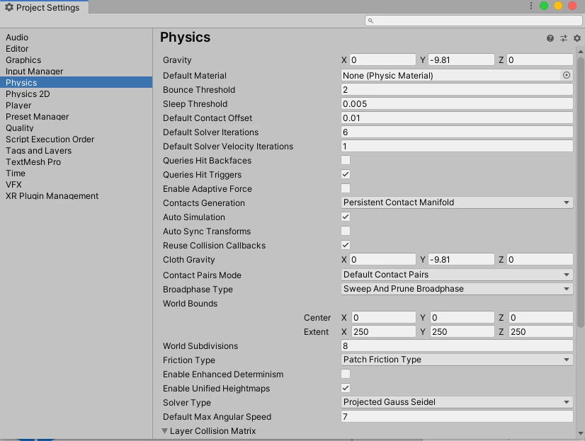

# Lab for Week 4, Session 1 - 3D Physics in Unity

This lab introduces 3D physics in [Unity](https://unity.com/). This module will use [3D Physics for object-oriented projects](https://docs.unity3d.com/Manual/PhysicsOverview.html), and not the newer [Data-Oriented Technology Stack (DOTS)](https://docs.unity3d.com/Packages/com.unity.physics@0.5/manual/index.html) physics package, which is still in preview and therefore, it is not yet production ready.

## Overview

Unity's physics engine has a breadth of tools that ensure objects are able to interact with other objects by approximating natural forces, such as gravity, velocity, acceleration, and friction. Figure 1 shows the properties of Unity's 3D physics engine.

_Figure 1: Unity's physics properties_

Figure 2 shows that a _RigidBody_ is a component that, when added to a _GameObject_, enables that object to react to physics events.

_Figure 2: RigidBody_

_Colliders_ allow Unity to register when two objects interact. For that to work, objects must be associated with a _RigidBody_ component.

_Triggers_ function similarly to _colliders_. However, when _triggers_ interact with _colliders_, they are ignored by the physics engine. Instead, they are able to execute scripts, which means they are useful for triggering all types of events; examples are tutorial messages or [cutscenes](https://en.wikipedia.org/wiki/Cutscene).

## A Simple Ball

(Gravity has a greater affect on objects with greater mass. [Drag](https://en.wikipedia.org/wiki/Drag_(physics) dampens linear [velocity](https://en.wikipedia.org/wiki/Velocity), and angular drag affects the rotational force of [angular velocity](https://en.wikipedia.org/wiki/Angular_velocity))

...

## Useful Links

+ [Intro' to the Unity Physics Engine](https://learn.unity.com/tutorial/intro-to-the-unity-physics-engine-2019-3)
+ [3D Physics for object-oriented projects](https://docs.unity3d.com/Manual/PhysicsOverview.html)
+ [Unity Physics Fundamentals](https://learn.unity.com/project/unity-physics-fundamentals)
