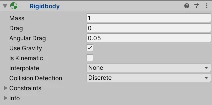

# Lab for Week 4, Session 1 - 3D Physics in Unity

This lab introduces 3D physics in [Unity](https://unity.com/). This module will demonstrate [3D physics for object-oriented projects](https://docs.unity3d.com/Manual/PhysicsOverview.html), and not the newer [Data-Oriented Technology Stack (DOTS)](https://docs.unity3d.com/Packages/com.unity.physics@0.5/manual/index.html) physics package, which is still in preview and therefore, not quite production-ready. However, should you be using DOTS already, then you are welcome to use that for your coursework.

## Overview

Unity's physics engine has a breadth of tools that ensure objects can interact with other objects by approximating natural forces, such as gravity, velocity, acceleration, and friction. Figure 1 shows the properties of Unity's 3D physics engine.

_Figure 1: Unity's physics properties_

Figure 2 shows that a _RigidBody_ is the main component that enables physical behaviour for a _GameObject_. Since a _Rigidbody_ component is responsible for the movement of the _GameObject_ to which it attached, you shouldn't try to move the _GameObject_ by changing its _Transform_ properties. Instead, you should [apply forces to push the GameObject](https://docs.unity3d.com/Manual/RigidbodiesOverview.html) and let the physics engine calculate the results.

_Figure 2: RigidBody_

_Colliders_ allow Unity to register when two objects interact. They define the [physical collision shape of a _GameObject_](https://docs.unity3d.com/Manual/CollidersOverview.html), such that, a _GameObject_ will react to incoming collisions if it has a _RigidBody_ component that is associated with one or more _Collider_ components. _Colliders_ are invisible and do not need to match the shape of their associated _GameObject_ mesh. The primitive _colliders_, _Box Collider_, _Sphere Collider_ and _Capsule Collider_ are the most straightforward and least processor-intensive.

_Triggers_ function similarly to _colliders_. However, when _triggers_ interact with _colliders_, they are ignored by the physics engine. Instead, they can execute scripts, which means they are useful for triggering all types of events; examples are some action when a _collider_ enters an area, tutorial messages or [cutscenes](https://en.wikipedia.org/wiki/Cutscene).

## Some Simple Physics

Below, you will introduce some wheels into the room you created in the [last lab](week3Session2.md) to demonstrate some of the physics capabilities of Unity.

First, a quick note on some of the physics you will witness, below. Gravity has a greater effect on objects with greater mass. [Drag](https://en.wikipedia.org/wiki/Drag_(physics)) dampens linear [velocity](https://en.wikipedia.org/wiki/Velocity), and angular drag affects the rotational force of [angular velocity](https://en.wikipedia.org/wiki/Angular_velocity)). [Friction](https://en.wikipedia.org/wiki/Friction) is a resistive force.

### Wheels

Open [Unity Hub](https://docs.unity3d.com/Manual/GettingStartedUnityHub.html) and open the project you created in the [last lab](./week3Session2.md).

You will need some more assets, so go to the [unity asset store](https://assetstore.unity.com/), and add [Ball Pack](https://assetstore.unity.com/packages/3d/props/ball-pack-446).

You are going to add a wheel, as in figure 3. Create a _GameObject_, _3D Object_, _Sphere_, rename it to _Wheel_, then move it, so it is to the side of the lamp on the stand but nearer the ceiling than the floor. Change the _Mesh_ to _WheelBall_. Change the material to _WheelBall_. If you wish, change the colour, too.

_Figure 3: The wheel_

Now you are going to make the wheel drop to the floor. Select it in the _Hieracrchy_. In the _Inspector_ tab, set the _Radius_ of the _Sphere Collider_ to 1. Then, select _Add Component_ and add a _Rigidbody_. Now press _Play_, and watch the wheel fall to the floor, as in Figure 4.

_Figure 3: The fallen wheel_

Stop playback, so the wheel returns to its original position. You are going to make it bounce. To do so, you need to add a _Physics Material_ to the wheel. First, create a new folder to hold your _Physics Materials_, and once in that folder, _Create_, _Physic Material_ and call it _Wheel_. Change its _Bounciness_ to 1 and both its _Friction_ parameters to 0.3. Then drag it onto your Wheel in the _Hierarchy_. Now press _Play_, and watch the wheel bounce off the floor.

Next, you are going to add multiple wheels into the scene, to see how they react. Copy your original wheel three times, and name the duplicates appropriately. Then, move the wheels, so they form two columns and two rows, such as that in Figure 4.

_Figure 4: Multiple wheels_

Press _Play_, and watch what happens. You can change the behaviour of the wheels when they hit the walls and floor by adding a _Rigidbody_ to them. Do that, and Figure 5 shows what happens when you hit _Play_ - the container walls begin falling away.

_Figure 5: The walls with gravity_

Fix that, by selecting _Is Kinematic_. That means gravity will not act on the walls because they will remain unaffected by the physics engine.

You may have also noticed that, when the wheels interact with the lampstand, they do not react appropriately. Fixing that problem involves the same processes as above - create a _Physics Material_ and change its _Friction_ parameters until you achieve the effect you are after - that is left as an exercise.

## Useful Links

+ [Intro' to the Unity Physics Engine](https://learn.unity.com/tutorial/intro-to-the-unity-physics-engine-2019-3)
+ [3D Physics for object-oriented projects](https://docs.unity3d.com/Manual/PhysicsOverview.html)
+ [Unity Physics Fundamentals](https://learn.unity.com/project/unity-physics-fundamentals)
+ [Physics Objects](https://www.youtube.com/watch?v=WTGcs10Sj34)
+ [Ragdoll Physics in Unity](https://www.youtube.com/watch?v=DInV-jHm9rk)
