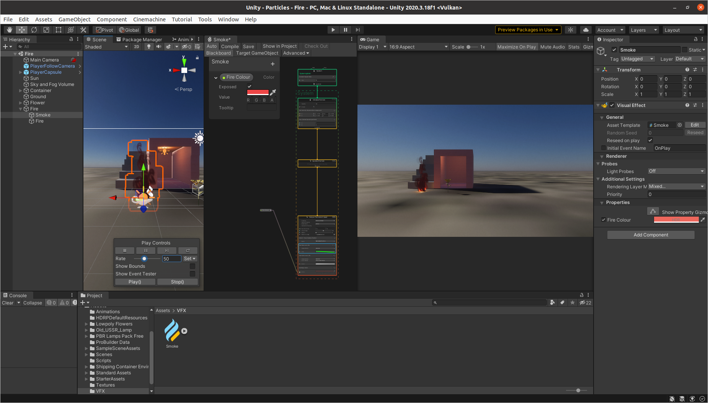
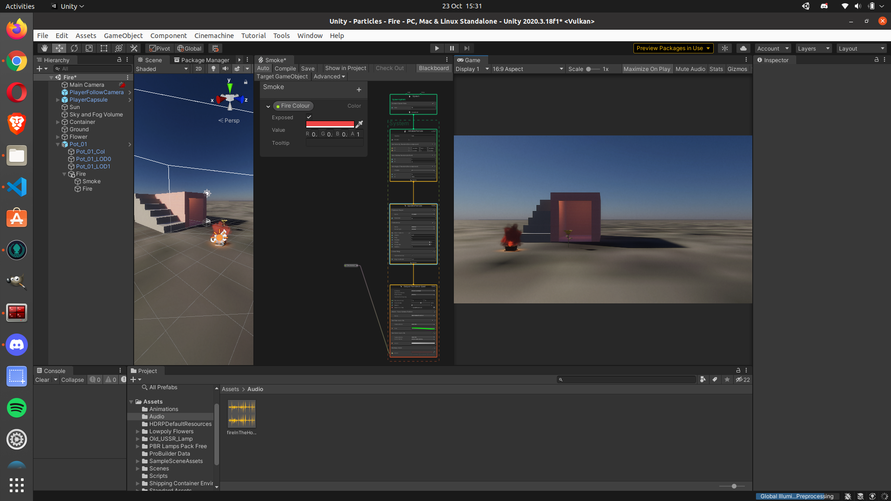

# Lab for Week 5, Session 1 - Particle Systems Using Visual Effects Graphs

This lab serves as an introduction to particle systems in Unity [Visual Effects Graphs](https://unity.com/visual-effect-graph).

## Overview

Particle systems create complex nebulous simulated animations through combinations of individual particles in the form of textures, material instances and entities. They are often used to create effects such as liquids, fire, fireworks, smoke and weather.

You can create particle systems in Unity in several ways; visual effect (VFX) graphs are the most intuitive, because they allow you to author visual effects using easily customisable node-based visual logic (if you are familiar with [Shader Graphs](https://docs.unity3d.com/Packages/com.unity.shadergraph@15.0/manual/index.html), then you already have some exerience of this node-based visual logic).

In this lab, you will use a VFX graph to create a fire.

## Fire in the Hole!

A word of warning before you start - never play with fire _outside_ of Unity :)

You _must_ use the High Definition Render Pipeline (HDRP) for this lab, since VFX graph is not out of preview with URP. Furthermore, it does not support all of the VFX graph features of HDRP, such as lit particles, which you need for the fire.

If you are already using HDRP (which should be most, if not all, of you), you may use one of the scenes from previous labs when creating the fire below. Otherwise, you have a couple of options. First (and most straightforward), you can create a new project and choose the High Definition Render Pipeline (HDRP) template (naming the project however you choose). Next, you will need to import the [Starter Assets - First Person Character Controller](https://assetstore.unity.com/packages/essentials/starter-assets-first-person-character-controller-196525) (FPC) you have used in previous labs. You will also need to create the ground upon which to place your fire, so your FPC can walk around it. Alternatively, if you wish to use a _Universal Render Pipeline_ (URP) project from one of your previous labs, you can switch to HDRP by installing it via the _Package Manager_. Then, in the _Projects_ window, _Create_, _Folder_, _Settings_, and in there, click _Create_, _Rendering_, _High Definition Render Pipeline Asset_. Now, go to _Edit_, _Project Settings_, _Graphics_ and drag your new HDRP settings asset into the _Scriptable Render Pipeline Settings_. As always, you will need to upgrade your project materials to use the new renderer.

You can now start creating the fire. First, in the _Projects_ window, _Create_, _Folder_ and call it _VFX_. Later, you are also going to need a fire [texture](https://docs.unity3d.com/Manual/Textures.html), so _Create_, _Folder_ and call that _Textures_, then go to the [P3D GitHub repository](https://github.com/glowkeeper/P3D), find the _sparksFlipbook_ texture in the _assets/textures_ directory, and drag it into your _Textures_ folder. [Flipbooks](https://vfxdoc.readthedocs.io/en/latest/textures/flipbooks/) are a single texture sheet that describes animated image states in a series of rows and columns. In essence, a flipbook is an efficient way to reference multiple images. The _sparksFlipbook_ is a 3 x 3 texture sheet.

Later, you will need some audio for the fire to make it crackle and pop, so _Create_, _Folder_ and call that _Audio_. Then go to the [P3D GitHub repository](https://github.com/glowkeeper/P3D), find the _fireInTheHole_ audio asset and drag that into your _Audio_ folder.

Now create the VFX graph. Go to the _VFX_ folder, and _Create_, _Visual Effects_, _Visual Effects Graph_, and name it _Smoke_. In the _Hierarchy_ window, _Create Empty_, and call that _Fire_ and drag your _Smoke VFX Graph_ into that. Finally, you will need to add a _Point Light_ that will become the fire itself, so within the _Fire_ parent _GameObject_, _Create_, _Light_, _Point Light_, rename it _Fire_, and set its lumens to _6000000_ in the inspector.

Now, double click the _Smoke VFX Graph_ to open its VFX Graph window - similar to other windows in Unity, you may dock that wheresoever you please.

First, delete the _Output Particle Quad_ context, and instead, connect an _Output Particle DRP Quad Lit_ context to your _Update Particle_. Next, change the _UV Mode_ to _Flipbook Blend_, the Flipbook size to 3 x 3, and set the _Base Color Map_ (main texture) to the _sparksFlipbook_ texture you imported earlier. You should experiment with the _Blend Mode_, since that changes the colour of your smoke; for example, setting it to _Alpha_ will produce a darker smoke than you will get if you set it to _Additive_.

You also need to add some blocks to your _Output Particle HDRP Quad Lit_ context. First, add an _Orient: Face Camera Position_ block (the default settings are acceptable) - this adds what is known as a _billboard effect_, which makes the flat 2-dimensional textures look 3-dimensional from any direction. Secondly, add a _Set Size Over Life_ block and set the graph so the particles begin life at full size and end half size. Now add _Set Color Over Lifetime_ and _Multiply Color_ blocks. Next, create a _Color_ property, call it _Fire Colour_ and ensure _Expose_ is set. Then drag the _Fire Colour_ property onto the VFX Graph. Connect it to the _Multiply Color_ block, and in the inspector for the VFX graph, change the colour to some shade of red. Hopefully, you have something that looks similar to Figure 1 below:

_Figure 1: Fire!_

That already looks pretty good! The rest of the lab concentrates on making the fire look _even better_.

First, let's concentrate on the _Spawn System_ and _Initialize Particle_ contexts - the higher the _Rate_, the larger your fire - the default is fine, but you should experiment; however, if you do increase the _Rate_, you should also increase the capacity of the _Initialize Particle_ context to match whatever you set. For this fire, the default settings for _Set Lifetime Random_ already works pretty well, but we want the smoke to rise straight up in the air, so change the settings for _Set Velocity Random_ so that _A_ is set to _-0.1_, _0.8_ and _-0.1_ for _x_, _y_ and _z_ respectively, and _B_ is set to _0.1_, _1_ and _0.1_. Again, _you_ should experiment by changing each value one by one and seeing the effect - the idea is to make the smoke behave realistically. Next, add a new _Set Angle Random_ block to the  _Initialize Particle_ node and set the _Channel_ to _Z_, _A_ to 0 and _B_ to _360_. You should see individual particles rising with random rotation.

Next,in the _Update_ context, you should add a _Flipbook Player_ that cycles through the textures in the _sparksFlipbook_. Set that to a _Frame Rate_ of 8. The _Update_ context is also where you should add some physics by applying some forces to the particles. First, Add a _Turbulence (Force)_ block and set the _Noise Type_ to _Cellular_, the _Intensity_ to 0.5 and move the _Octaves_ and _Roughness_ sliders all the way to the right. Next, add a _Linear Drag_ force, set the _Use Particle Size_ field - the larger your particles, the more they are affected by drag forces, which adds a very nice realistic effect to the fire.

Finally, you should add something to house the fire. Figure 2, below, shows the fire in a pot (it is the _Pot 01_ _Prefab_ from the _SampleSceneAssets_, scaled to 2 on the x and z-axis).

_Figure 2: Fire in the Hole (Pot)!_

## Crackle and Pop

Below, you will add a simple attenuated 3D sound to the fire so that its volume increases and decreases as your FPC gets closer or moves further away.

### Adding Some Sound to the Fire

Add an _AudioSource_ to the fire and drag the _fireInTheHole_ audio file you imported earlier into its _AudioClip_ field in the inspector. Ensure it is set to _Play on Awake_ and _Loop_. Press _Play_, and you should hear the fire begin to crackle and pop.

As for the radio in the previous lab, no matter the FPC's distance from the fire, the sound will maintain the same volume. To change that, in the fire's _AudioSource_, set the _Spatial Blend_ field to _1_ - that enables the _AudioClip_ to take on 3D properties. Now, in the _3D Sound Settings_, set the Max Distance to 20, and at the 20 point on the graph's x-axis, ensure the sound volume is zero. Also, set the maximum volume at 5 metres (you don't want to get too close to the fire to hear it). So now, when you approach and walk away from the fire, the volume should increase and decrease.

## Extended

Play around with _all_ of the VFX settings to see their effect.

Create a fire in an inside setting, perhaps by modelling a chimney breast or oven (you may be able to use some assets from the [Unity Asst Store](https://assetstore.unity.com/)), and make your fire look realistic, there.

## Useful Links

+ [Visual Effects Graphs](https://unity.com/visual-effect-graph)
+ [Output Lit](https://docs.unity3d.com/Packages/com.unity.visualeffectgraph@10.2/manual/Context-OutputLitSettings.html)
+ [Turbulence](https://docs.unity3d.com/Packages/com.unity.visualeffectgraph@10.2/manual/Block-Turbulence.html)
+ [Fire and Smoke with Unity VFX Graph](https://www.youtube.com/watch?v=R6D1b7zZHHA)
+ [Stylised Fire using URP](https://www.youtube.com/watch?v=XQlFokCzU6M)
+ [Creating Fire, Smoke and Mist](https://www.youtube.com/watch?v=OCzGXcdyqnQ)
+ [freesound](https://freesound.org/)